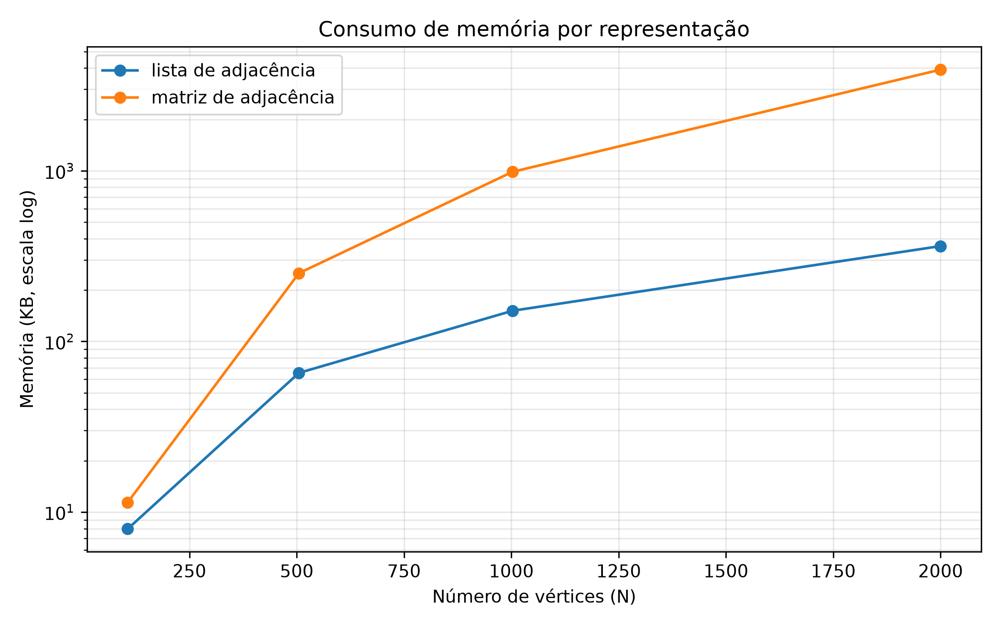
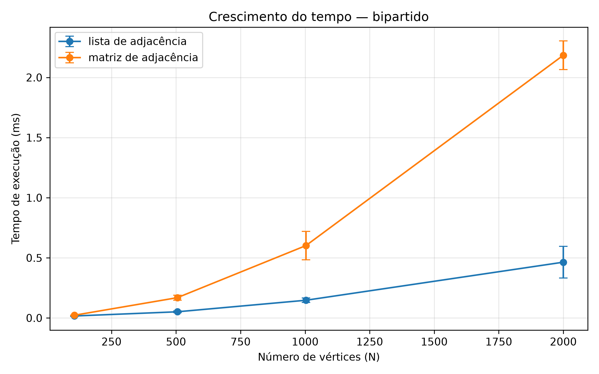
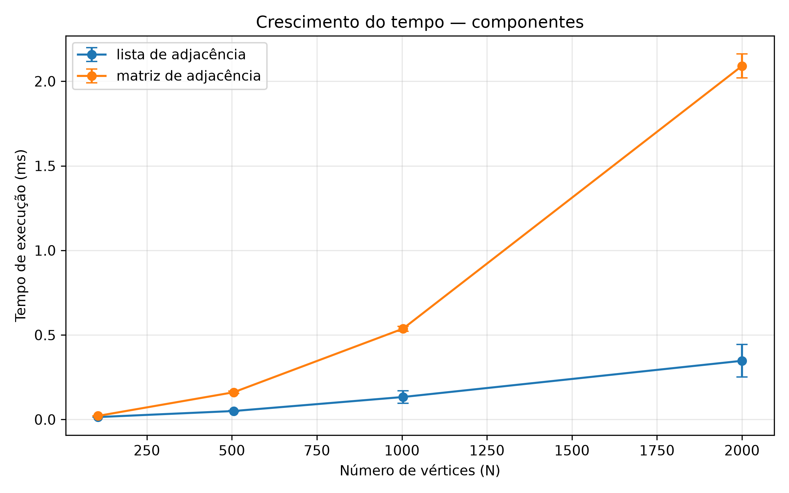
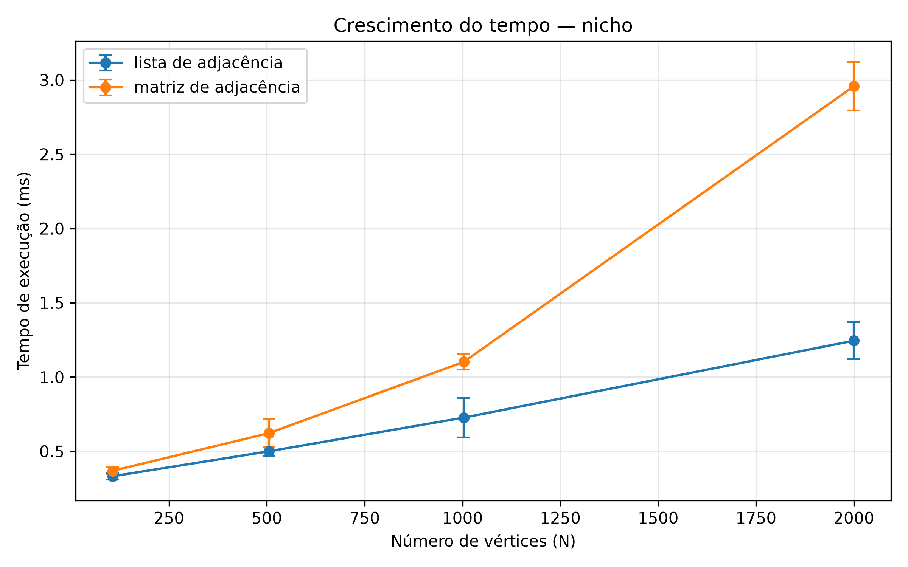
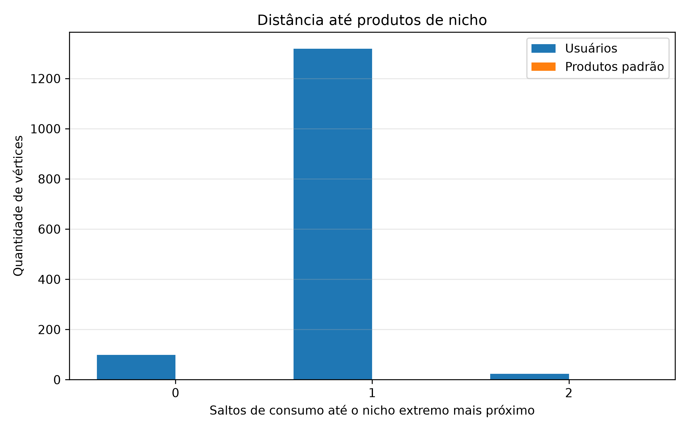

# Análise de Grafos Bipartidos em Redes de Consumo: Desempenho e Distância até Produtos de Nicho

**Autores:** Yuri Victor, Pedro Arthur, Danielly Luz, Gabriel Vieira Braga  
**Instituição:** IESB 
**Disciplina:** Projeto Integrador 3B
**Ano:** 2026

## Resumo

Este trabalho apresenta a modelagem e a análise de uma rede de consumo por meio
de um grafo bipartido formado por usuários e produtos. O objetivo é investigar a
estrutura dessa rede, comparar diferentes formas de representação computacional
do grafo e medir a distância entre consumidores e produtos classificados como de
nicho extremo.

O grafo completo utilizado nos experimentos possui 2.100 vértices, sendo 1.500
usuários e 600 produtos, conectados por 11.107 arestas que representam relações
de compra. Foram implementados algoritmos para verificação de bipartição,
identificação de componentes conexos e cálculo da distância até produtos de
nicho. As execuções foram realizadas com representações por lista e por matriz de
adjacência em subamostras crescentes do conjunto de dados.

Os resultados mostram que a lista de adjacência apresentou menor consumo de
memória e, nas maiores amostras, menores tempos de execução. No grafo completo,
todos os 1.500 usuários alcançam algum produto de nicho em no máximo dois saltos
de consumo, sendo que 98,2% estão a no máximo um salto. Os resultados indicam
que, apesar da baixa densidade do grafo, produtos de nicho permanecem
estruturalmente próximos da maior parte dos consumidores.

**Palavras-chave:** grafos bipartidos; busca em largura; redes de consumo;
produtos de nicho; lista de adjacência; matriz de adjacência.

---

## 1. Introdução

Plataformas de comércio eletrônico podem ser interpretadas como redes nas quais
consumidores se relacionam com produtos por meio de compras. Essa estrutura pode
ser naturalmente modelada como um grafo bipartido, pois existem dois conjuntos
distintos de vértices: usuários e produtos. As arestas ligam elementos de
conjuntos diferentes e representam interações de consumo.

A modelagem por grafos permite investigar propriedades que não são facilmente
observadas analisando apenas tabelas de compras. É possível, por exemplo,
verificar a conectividade entre consumidores, identificar grupos de consumo,
avaliar a distância entre diferentes regiões da rede e estudar produtos de baixa
popularidade.

Neste trabalho, o interesse principal está nos chamados produtos de nicho
extremo. Esses produtos apresentam baixa popularidade e pertencem a segmentos
menos representados do catálogo. A pergunta que orienta a análise é: **quão
distante um consumidor está de um produto de nicho dentro da rede de consumo?**

Além da análise estrutural, o trabalho compara duas formas clássicas de
representação de grafos: lista de adjacência e matriz de adjacência. Essa
comparação é relevante porque o grafo analisado é esparso e, nesse tipo de
cenário, a escolha da estrutura de dados pode causar diferenças significativas
de memória e tempo de execução.

Os objetivos desta etapa são, portanto: verificar computacionalmente a natureza
bipartida do grafo; analisar sua conectividade; calcular a distância dos usuários
até produtos de nicho; comparar o desempenho de lista e matriz de adjacência; e
avaliar o crescimento dos algoritmos em amostras progressivamente maiores.

---

## 2. Referencial Teórico

### 2.1 Grafos e grafos bipartidos

Um grafo pode ser representado por um conjunto de vértices e um conjunto de
arestas que conectam pares desses vértices. Em um grafo bipartido, o conjunto de
vértices pode ser separado em duas partições, de maneira que as arestas ocorram
somente entre vértices pertencentes a partições diferentes.

No contexto deste trabalho, uma partição contém usuários e a outra contém
produtos. Uma aresta entre um usuário e um produto indica uma compra. Dessa
forma, não existem relações usuário--usuário ou produto--produto.

Uma maneira de confirmar que um grafo é bipartido é realizar uma 2-coloração:
cada vértice recebe uma de duas cores, e vértices ligados por uma aresta devem
possuir cores diferentes. Caso seja encontrada uma aresta entre vértices de
mesma cor, o grafo não é bipartido.

### 2.2 Busca em largura

A Busca em Largura, ou BFS (*Breadth-First Search*), explora o grafo por níveis
de distância. Inicialmente são visitados os vértices de origem, depois seus
vizinhos diretos, em seguida os vizinhos ainda não visitados desses vértices, e
assim sucessivamente.

Essa característica faz da BFS uma técnica adequada para calcular menores
distâncias em grafos não ponderados. Neste projeto, ela é empregada tanto na
análise de componentes conexos quanto no cálculo da distância até produtos de
nicho.

Para calcular a proximidade ao nicho, os produtos classificados como nicho são
utilizados simultaneamente como origens da busca. Assim, para cada vértice do
grafo é obtida a menor distância até algum produto de nicho.

### 2.3 Lista e matriz de adjacência

Na lista de adjacência, cada vértice mantém uma relação apenas com seus vizinhos.
Essa estrutura tende a ser eficiente em grafos esparsos, pois armazena
principalmente as arestas existentes.

Na matriz de adjacência, por outro lado, é reservada uma posição para cada
possível par de vértices. A estrutura possibilita verificar diretamente a
existência de uma aresta, porém o espaço utilizado cresce com o quadrado do
número de vértices.

Como o conjunto analisado possui densidade relativamente baixa, a comparação
entre as duas representações permite observar experimentalmente o impacto dessa
diferença.

---

## 3. Metodologia

### 3.1 Construção do conjunto de dados

O catálogo de origem contém 200.003 produtos de varejo eletrônico. O material
possui identificador, nome, categoria e valor dos produtos.

O catálogo original apresentava somente três categorias amplas: Comunicação,
Informática e Eletrônicos. Para aumentar a granularidade da análise, foram
extraídos dos nomes dos produtos 24 tipos, como Smartwatch, Roteador Wi-Fi,
Power Bank e Placa de Vídeo.

Essa transformação utiliza informação já contida no próprio nome do produto,
estruturando-a para permitir uma classificação mais detalhada.

A amostra final utilizada no grafo contém 600 produtos. A seleção não foi
uniforme: os tipos foram distribuídos seguindo uma lei de potência, produzindo
categorias maiores e menores. Essa decisão possibilita representar uma
distribuição mais desigual entre segmentos e, consequentemente, diferenciar
produtos comuns de produtos de nicho.

O processo utiliza semente aleatória fixa igual a 42, permitindo reproduzir o
mesmo conjunto de dados.

### 3.2 Estrutura do grafo

O grafo completo possui:

| Métrica | Valor |
|---|---:|
| Usuários | 1.500 |
| Produtos | 600 |
| Vértices | 2.100 |
| Arestas | 11.107 |
| Tipos de produto | 24 |
| Grau médio dos produtos | 18,5 |
| Grau máximo | 94 |
| Grau mínimo | 1 |
| Densidade | 1,23% |

Foram verificadas a inexistência de arestas duplicadas, índices inválidos,
arestas dentro da mesma partição e vértices isolados.

A densidade de 1,23% caracteriza o conjunto como um grafo esparso.

### 3.3 Classificação dos produtos

Os produtos são classificados utilizando uma combinação entre impopularidade e
raridade do tipo:

`score = 0,6 × impopularidade + 0,4 × raridade do tipo`

Ao final da classificação, os 600 produtos são distribuídos em:

| Classe | Produtos |
|---|---:|
| Nicho extremo | 30 |
| Padrão | 150 |
| Intermediário | 420 |

Os produtos de nicho possuem grau entre 1 e 10, enquanto produtos padrão possuem
grau entre 28 e 94. Assim, as classes extremas não se sobrepõem em relação ao
grau.

### 3.4 Subamostras

Para avaliar o crescimento do tempo e da memória foram utilizadas quatro
subamostras geradas por expansão em largura:

| Amostra | Usuários | Produtos | Vértices | Arestas |
|---|---:|---:|---:|---:|
| n100 | 46 | 60 | 106 | 215 |
| n500 | 360 | 145 | 505 | 1.902 |
| n1000 | 758 | 245 | 1.003 | 4.462 |
| n2000 | 1.441 | 559 | 2.000 | 10.830 |

A expansão em largura foi utilizada para preservar a vizinhança e a conectividade
local do grafo.

### 3.5 Protocolo experimental

Foram avaliados três algoritmos:

1. verificação de bipartição;
2. contagem de componentes conexos;
3. cálculo da distância até produtos de nicho.

Cada algoritmo foi executado sobre as quatro amostras e nas duas
representações, lista e matriz de adjacência.

Para cada configuração foram realizadas 10 execuções. As duas primeiras foram
descartadas como aquecimento e as oito restantes foram utilizadas para calcular
média e desvio-padrão.

O tempo foi medido com `CLOCK_MONOTONIC`, e a memória foi determinada a partir
da estrutura de representação utilizada pelo grafo.

---

## 4. Resultados e Discussão

### 4.1 Verificação estrutural

O teste de 2-coloração confirmou que o grafo completo é bipartido. Foram
identificados 1.500 usuários e 600 produtos, sem divergências entre as
partições.

A análise de conectividade também retornou apenas um componente conexo. Portanto,
todos os vértices pertencem à mesma componente da rede analisada.

Esses resultados estão de acordo com as verificações realizadas durante a
construção do dataset.

### 4.2 Consumo de memória

A Figura 1 apresenta a memória utilizada pelas duas representações.

**Figura 1 -- Consumo de memória das representações do grafo.**

Na amostra com 2.000 vértices, a lista utilizou 370.560 bytes, aproximadamente
361,9 KB, enquanto a matriz utilizou 4.008.000 bytes, aproximadamente 3.914 KB.

Portanto, nessa amostra, a matriz consumiu cerca de 10,8 vezes mais memória do
que a lista.

Esse comportamento se torna mais evidente conforme o número de vértices cresce.
Como o grafo é esparso, a lista armazena principalmente as relações que
efetivamente existem, enquanto a matriz reserva espaço para pares de vértices
mesmo quando não existe aresta entre eles.

### 4.3 Verificação de bipartição

A Figura 2 apresenta os tempos médios da verificação de bipartição.

**Figura 2 -- Tempo de execução da verificação de bipartição.**

Na amostra com 2.000 vértices, a média obtida com lista foi de 0,464 ms, enquanto
a matriz apresentou 2,185 ms.

Assim, nessa configuração, a matriz levou aproximadamente 4,7 vezes o tempo da
lista.

A diferença cresce nas maiores amostras, evidenciando a vantagem da lista para o
grafo esparso utilizado no experimento.

### 4.4 Componentes conexos

A Figura 3 apresenta os resultados do algoritmo de componentes conexos.

**Figura 3 -- Tempo de execução da contagem de componentes.**

Para 2.000 vértices, a lista apresentou média de 0,347 ms, enquanto a matriz
apresentou 2,091 ms.

A matriz foi, portanto, aproximadamente seis vezes mais lenta nessa amostra.

O algoritmo encontrou um único componente conexo no grafo completo, mostrando
que todos os usuários e produtos analisados fazem parte de uma mesma estrutura
conectada.

### 4.5 Distância até produtos de nicho

A Figura 4 mostra o crescimento do tempo do algoritmo de distância até o nicho.

**Figura 4 -- Tempo de execução do cálculo de distância ao nicho.**

Na maior subamostra, o tempo médio foi de 1,245 ms com lista de adjacência e
2,958 ms com matriz.

Embora a diferença relativa seja menor do que nos outros dois algoritmos, a
lista também apresentou vantagem.

O resultado mais relevante para a pergunta de negócio é apresentado na Figura 5.

**Figura 5 -- Distribuição da distância até produtos de nicho no grafo completo.**

Entre os 1.500 usuários:

| Saltos de consumo | Usuários | Percentual |
|---|---:|---:|
| 0 | 108 | 7,2% |
| 1 | 1.365 | 91,0% |
| 2 | 27 | 1,8% |

Todos os usuários possuem caminho até algum produto de nicho. Além disso, 1.473
usuários, correspondentes a 98,2% do total, encontram-se a no máximo um salto de
consumo do nicho.

A média observada foi de aproximadamente 0,946 salto por usuário, e a maior
distância registrada foi de dois saltos.

Na métrica implementada, um valor igual a zero representa um usuário diretamente
adjacente a um produto de nicho. Um salto representa a necessidade de atravessar
uma relação intermediária de consumo, enquanto dois saltos representam uma
separação maior dentro da rede.

Os resultados mostram que produtos de nicho não estão estruturalmente isolados.
Embora possuam baixa popularidade individual, eles podem ser alcançados a partir
da grande maioria dos consumidores por poucos passos na rede.

Esse comportamento sugere que baixa popularidade não implica necessariamente
grande distância estrutural. Produtos pouco consumidos podem continuar próximos
de regiões densamente conectadas do grafo através dos consumidores que
compartilham produtos intermediários.

### 4.6 Comparação geral das representações

A Tabela a seguir resume os resultados da maior subamostra.

| Algoritmo | Lista (ms) | Matriz (ms) |
|---|---:|---:|
| Bipartição | 0,464 | 2,185 |
| Componentes | 0,347 | 2,091 |
| Nicho | 1,245 | 2,958 |

A lista apresentou menor tempo em todos os algoritmos analisados na amostra com
2.000 vértices.

A diferença de memória também foi expressiva: cerca de 361,9 KB para lista e
3.914 KB para matriz.

Esses resultados são coerentes com a estrutura esparsa do grafo. Para este
conjunto de dados, a lista de adjacência oferece uma relação mais favorável entre
uso de memória e tempo de execução.

---

## 5. Conclusão

Este trabalho modelou uma rede de consumo como um grafo bipartido entre usuários
e produtos e analisou propriedades estruturais e computacionais dessa
representação.

O grafo completo possui 2.100 vértices e 11.107 arestas, formando uma única
componente conexa e respeitando integralmente a separação entre usuários e
produtos.

A comparação entre lista e matriz de adjacência mostrou que a lista é mais
adequada para o conjunto analisado. Na maior subamostra, ela consumiu cerca de
10,8 vezes menos memória e apresentou menores tempos de execução nos três
algoritmos avaliados.

A análise de distância até produtos de nicho mostrou ainda que os itens menos
populares não estão distantes da rede principal de consumidores. Todos os 1.500
usuários alcançam algum produto de nicho em no máximo dois saltos de consumo e
98,2% estão a no máximo um salto.

Assim, os resultados indicam que a modelagem por grafos permite observar não
apenas a popularidade direta dos produtos, mas também sua posição relativa na
estrutura de consumo. Essa perspectiva pode ser útil em estudos futuros sobre
recomendação, descoberta de produtos e identificação de padrões de consumo.

Como trabalhos futuros, podem ser avaliados conjuntos maiores, diferentes
critérios de classificação de nicho e outras métricas de grafos, como
centralidade, comunidades e caminhos entre grupos específicos de consumidores.

---

## Referências

CORMEN, T. H.; LEISERSON, C. E.; RIVEST, R. L.; STEIN, C.
**Introduction to Algorithms**. 3. ed. Cambridge: MIT Press, 2009.

SZWARCFITER, J. L.
**Grafos e Algoritmos Computacionais**. 2. ed. Rio de Janeiro: Campus, 1986.

GOODRICH, M. T.; TAMASSIA, R.; GOLDWASSER, M. H.
**Data Structures and Algorithms in Python**. Hoboken: Wiley, 2013.

Os dados, códigos, resultados experimentais e figuras utilizados neste trabalho
estão disponíveis no repositório do projeto.